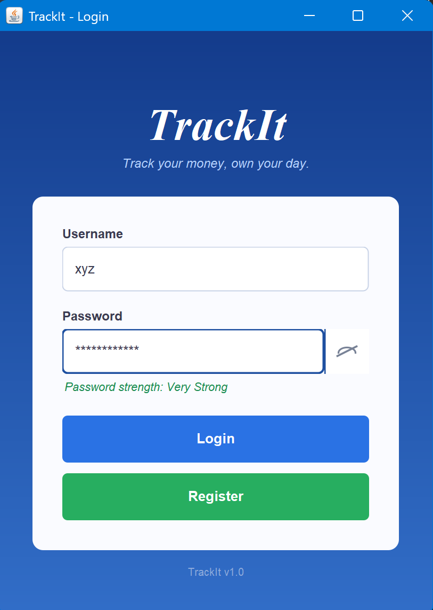
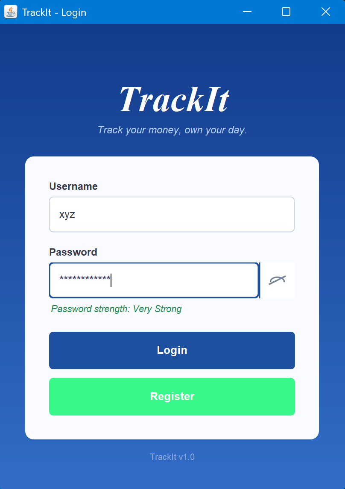
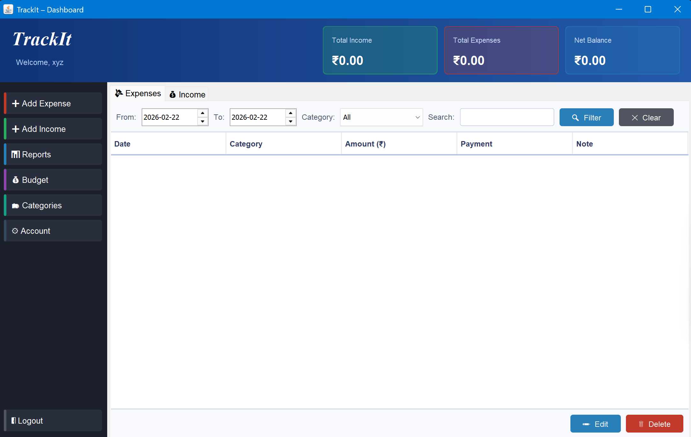
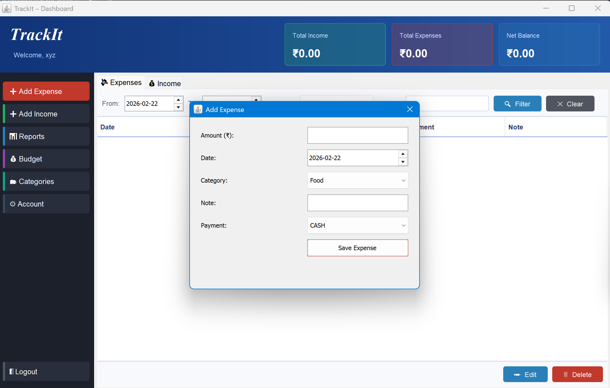
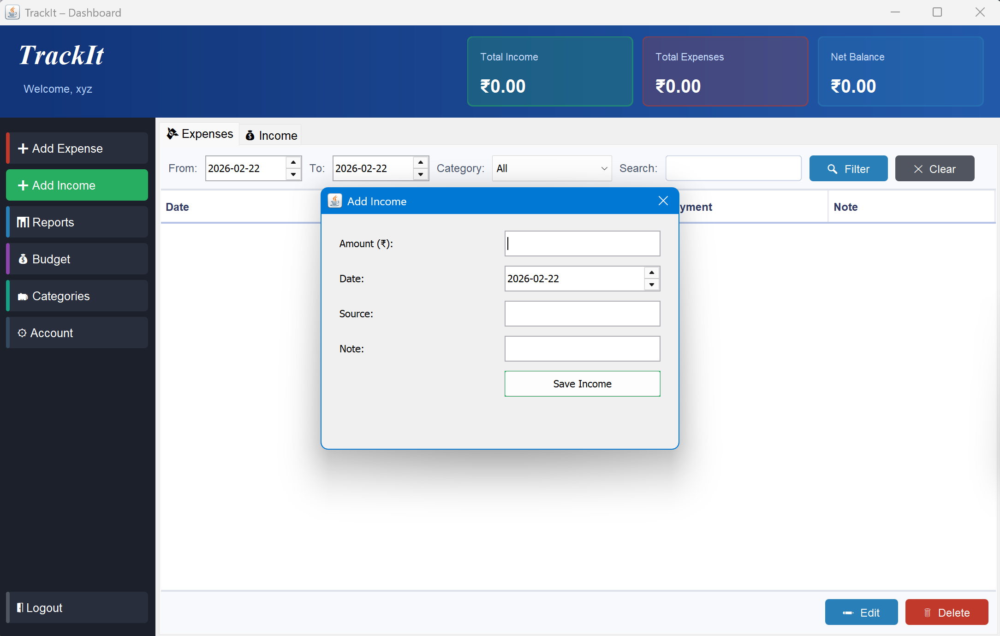
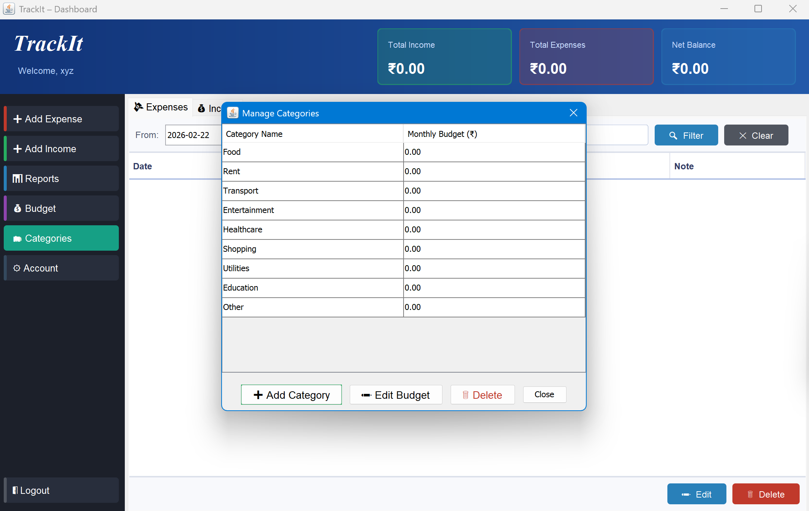
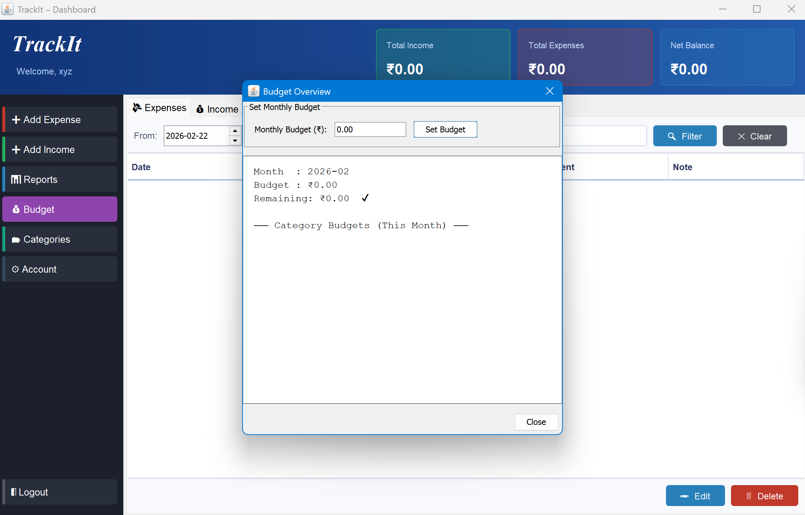
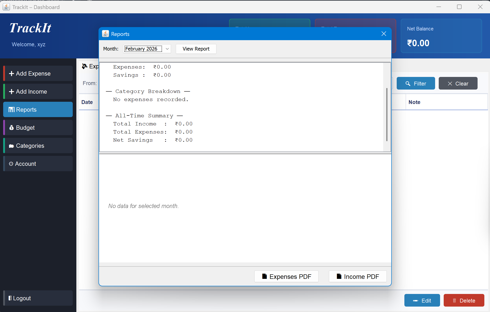
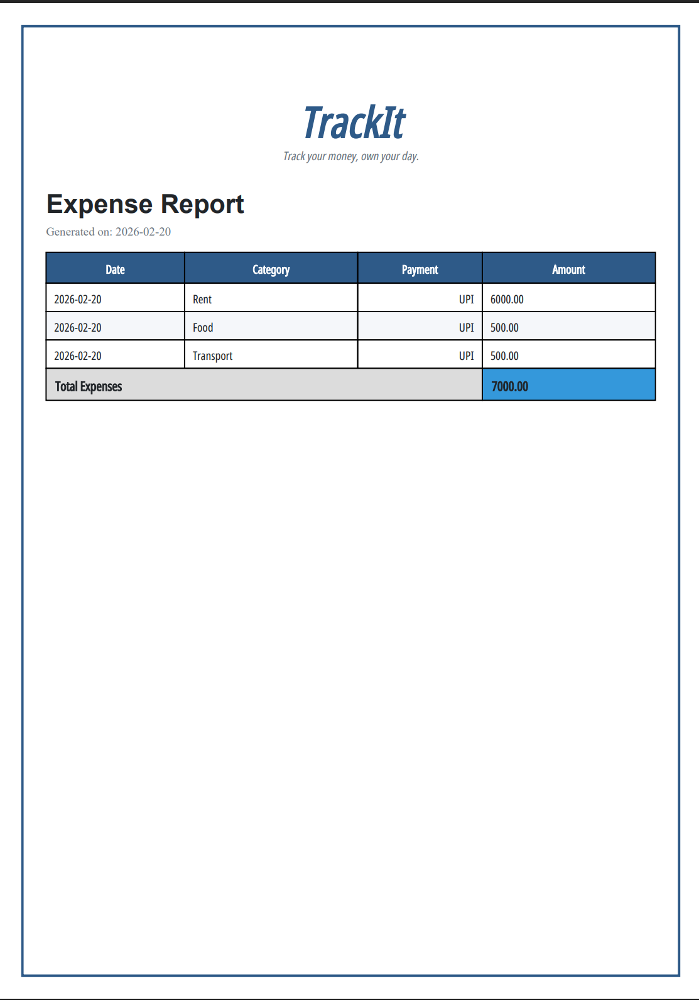

<div align="center">


# 💰 TrackIt

### *Track your money, own your day.*

A personal finance desktop application built with **Java Swing** — beautifully designed, fully offline, and ready to install on any machine without needing Java pre-installed.

<br/>

[](https://adoptium.net/)
[](https://gradle.org/)
[](LICENSE)
[]()
[]()
[]()

<br/>

[📥 Download](#-download) · [✨ Features](#-features) · [📸 Screenshots](#-screenshots) · [🔨 Build from Source](#-building-from-source) · [📁 Project Structure](#-project-structure) · [🗄️ Data Storage](#%EF%B8%8F-data-storage) · [🚀 Releasing](#-releasing-a-new-version)

<br/>

> **No Java installation required** — the JVM is bundled with the installer.

</div>

---

## 📥 Download

Head to the [**Releases**](../../releases/latest) page and grab the installer for your OS:

| Platform | Installer | Installation |
|----------|-----------|--------------|
| 🪟 **Windows** | `.exe` | Run the installer wizard, follow the prompts |
| 🍎 **macOS** | `.dmg` | Open the disk image, drag TrackIt to Applications |
| 🐧 **Ubuntu / Debian** | `.deb` | `sudo apt install ./trackit_*.deb` |

> **Note:** Windows may show a SmartScreen warning on first run since the binary isn't code-signed yet. Click **"More info" → "Run anyway"** to proceed.

<div align="right"><a href="#-trackit">↑ Back to top</a></div>

---

## ✨ Features

<table>
<tr>
<td width="50%">

### 📊 Dashboard
Live summary cards showing total income, total expenses, and net balance at a glance. Tables refresh automatically after every add/edit/delete.

### 💸 Expense Tracking
Add, edit, and delete expenses with:
- Date picker (any past or future date)
- Category dropdown (no free-text errors)
- Payment method: Cash, Card, UPI, Bank Transfer
- Optional note field

### 💰 Income Tracking
Log multiple income sources with date, source label, and notes. Full edit and delete support in the same table UI.

### 📁 Category Management
Create custom categories, set individual monthly budgets per category, edit names and limits inline, or delete categories you no longer need.

</td>
<td width="50%">

### 💼 Budget Management
Set a global monthly spending budget that **persists across restarts** (stored in `budget.properties`). View remaining budget and per-category budget status with ✔ / ⚠ indicators.

### 📈 Reports & PDF Export
- Monthly report with income vs expense summary
- Pie chart breakdown by category
- Export to **PDF** — professionally formatted with logo and totals row

### 🔐 User Accounts
- Salted SHA-256 password hashing (per-user salt)
- Change password from Account Settings
- Delete account — wipes all associated data permanently

### 🔍 Filtering & Search
Filter expenses and income by date range, category, or keyword.

</td>
</tr>
</table>

<div align="right"><a href="#-trackit">↑ Back to top</a></div>

---

## 📸 Screenshots

### 🔐 Login & Registration

| Login Screen | Register Screen |
|---|---|
|  |  |

*Secure login with salted SHA-256 password hashing. New users get 9 default categories on registration.*

---

### 📊 Dashboard



*The main dashboard showing total income, total expenses, net savings, and full expense/income tables with edit and delete actions.*

---

### 💸 Expense & Income Management

| Add Expense | Add Income |
|---|---|
|  |  |

*Add expenses with category, payment method, date, and notes. Log income with source and date.*

---

### 📁 Categories & 💼 Budget

| Manage Categories | Budget Overview |
|---|---|
|  |  |

*Set monthly budgets per category. Budget overview shows remaining balance and ⚠ alerts when over budget.*

---

### 📈 Reports

| Monthly Report | 
|---|
|  |

*Monthly income*

---

### 📄 PDF Generated



*Professional PDF report with app branding, formatted table, and total row — ready to save or share.*

---

> 📷 **Want to contribute screenshots?**
> Take screenshots of each screen and open a Pull Request adding them to a `screenshots/` folder in the repo root. See the [Contributing](#-contributing) section below.

<div align="right"><a href="#-trackit">↑ Back to top</a></div>

---

## 🔨 Building from Source

### Prerequisites

| Tool | Version | Download |
|------|---------|----------|
| JDK  | 21+     | [Temurin (recommended)](https://adoptium.net/) |
| Gradle | 9.3+ | Included via `gradlew` wrapper |
| WiX Toolset *(Windows only)* | 3.x | [wixtoolset.org](https://wixtoolset.org/) — required for `.exe` packaging |

### Clone and run

```bash
git clone https://github.com/abhi-pillai/First_Gradle_Project.git
cd First_Gradle_Project
./gradlew run           # Linux / macOS
gradlew run             # Windows
```

### Build a fat JAR

```bash
./gradlew shadowJar
java -jar app/build/libs/TrackIt.jar
```

### Build a native installer

```bash
# Builds installer for your current OS
./gradlew jpackage      # Linux / macOS
gradlew jpackage        # Windows
```

Output will be in `app/build/dist/`.

> **Cross-compiling is not supported** — build on Windows to get `.exe`, on macOS to get `.dmg`, on Linux to get `.deb`. GitHub Actions handles all platforms automatically on each release tag.

<div align="right"><a href="#-trackit">↑ Back to top</a></div>

---

## 📁 Project Structure

```
First_Gradle_Project/
├── .github/
│   └── workflows/
│       └── release.yml                       # CI/CD — builds all 3 installers on tag push
├── screenshots/                              # App screenshots (for README)
├── app/
│   └── src/main/java/com/myexpense/expensetracker/
│       ├── Main.java                         # Entry point
│       ├── model/                            # Data models
│       │   ├── User.java
│       │   ├── Expense.java
│       │   ├── Income.java
│       │   ├── Category.java
│       │   └── PaymentMethod.java            # Enum: CASH, CARD, UPI, BANK_TRANSFER
│       ├── repository/                       # CSV persistence layer
│       │   ├── UserRepository.java
│       │   ├── ExpenseRepository.java
│       │   ├── IncomeRepository.java
│       │   └── CategoryRepository.java
│       ├── service/                          # Business logic
│       │   ├── AuthService.java              # Login, register, change password, delete account
│       │   ├── ExpenseService.java           # CRUD + filter + PDF export
│       │   ├── IncomeService.java            # CRUD + filter + PDF export
│       │   ├── CategoryService.java          # CRUD + default category seeding
│       │   ├── BudgetService.java            # Monthly + per-category budgets
│       │   └── ReportService.java            # Summary + category breakdown
│       ├── ui/                               # Swing UI layer
│       │   ├── LoginFrame.java               # Login / register screen
│       │   ├── DashboardFrame.java           # Main app window
│       │   ├── AddExpenseDialog.java
│       │   ├── AddIncomeDialog.java
│       │   ├── EditExpenseDialog.java
│       │   ├── EditIncomeDialog.java
│       │   ├── BudgetDialog.java
│       │   ├── ReportsDialog.java
│       │   ├── ManageCategoriesDialog.java
│       │   └── AccountSettingsDialog.java
│       └── util/
│           └── PasswordUtil.java             # Salt generation + SHA-256 hashing
└── src/main/resources/
    └── fonts/
        └── NotoSans_ExtraCondensed-Regular.ttf   # Bundled font for ₹ symbol
```

<div align="right"><a href="#-trackit">↑ Back to top</a></div>

---

## 🗄️ Data Storage

All data is stored **locally on your device**. Nothing is sent to the cloud.

| Platform | Location |
|----------|----------|
| 🪟 Windows | `C:\Users\YourName\AppData\Roaming\TrackIt\data\` |
| 🍎 macOS | `~/Library/Application Support/TrackIt/data/` |
| 🐧 Linux | `~/.local/share/TrackIt/data/` |

| File | Contents | Format |
|------|----------|--------|
| `users.csv` | User accounts (id, username, hashed password, salt) | CSV |
| `expenses.csv` | All expense records across all users | CSV |
| `income.csv` | All income records across all users | CSV |
| `categories.csv` | Custom categories with monthly budgets | CSV |
| `budget.properties` | Per-user global monthly budget | Java Properties |

### Multi-user isolation

Every record includes a `userId` column. All repository queries filter strictly by the logged-in user's ID — **User A cannot see User B's data**, even though they share the same CSV files on disk.

### Backing up your data

Copy the `TrackIt/data/` folder from your platform's location above to anywhere safe. To restore, paste it back. The files are plain text and can be opened in any spreadsheet application.

<div align="right"><a href="#-trackit">↑ Back to top</a></div>

---

## 🛠️ Tech Stack

| Layer | Technology | Purpose |
|-------|-----------|---------|
| Language | Java 21 | Core application |
| UI Framework | Java Swing | Desktop GUI |
| Build Tool | Gradle 9.3 | Compilation, packaging, tasks |
| Native Packaging | jpackage (JDK built-in) | Bundles JVM into installer |
| Fat JAR | Shadow Plugin 8.3.5 | Bundles all dependencies |
| CSV Parsing | OpenCSV 5.9 | Reading and writing data files |
| PDF Export | OpenPDF 1.3 | Generating expense/income reports |
| Password Security | SHA-256 + random salt | Per-user salted password hashing |

<div align="right"><a href="#-trackit">↑ Back to top</a></div>

---

## 🚀 Releasing a New Version

Commit your changes, tag, and push:

```bash
git add .
git commit -m "Release v1.1.0"
git push
git tag v1.1.0
git push origin v1.1.0
```

GitHub Actions will automatically:
1. Build on **Windows**, **macOS**, and **Linux** runners in parallel
2. Package each platform's native installer via `jpackage`
3. Publish all three installers to the **GitHub Releases** page

<div align="right"><a href="#-trackit">↑ Back to top</a></div>

---

## 🤝 Contributing

Contributions, bug reports, and feature requests are welcome!

1. Fork the repository
2. Create a feature branch: `git checkout -b feature/your-feature`
3. Commit your changes: `git commit -m "Add your feature"`
4. Push and open a Pull Request

Please follow the existing layer structure: **model → repository → service → UI**

<div align="right"><a href="#-trackit">↑ Back to top</a></div>

---

## 📄 License

This project is licensed under the **MIT License** — see [LICENSE](LICENSE) for details.

---

<div align="center">

Made with ❤️ using Java Swing

*TrackIt — Track your money, own your day.*

<br/>

[↑ Back to top](#-trackit)

</div>